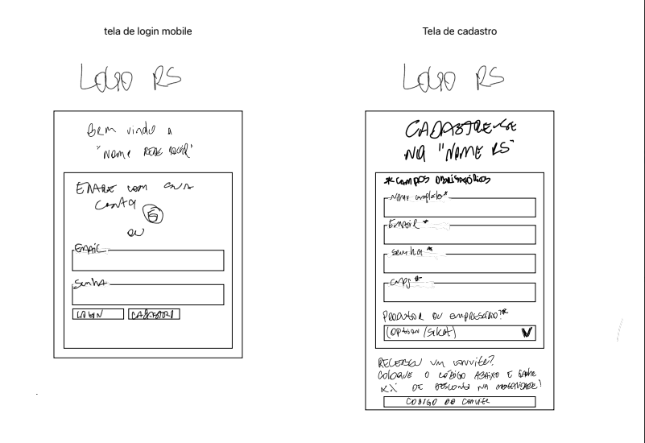
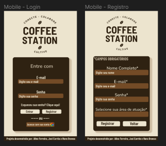
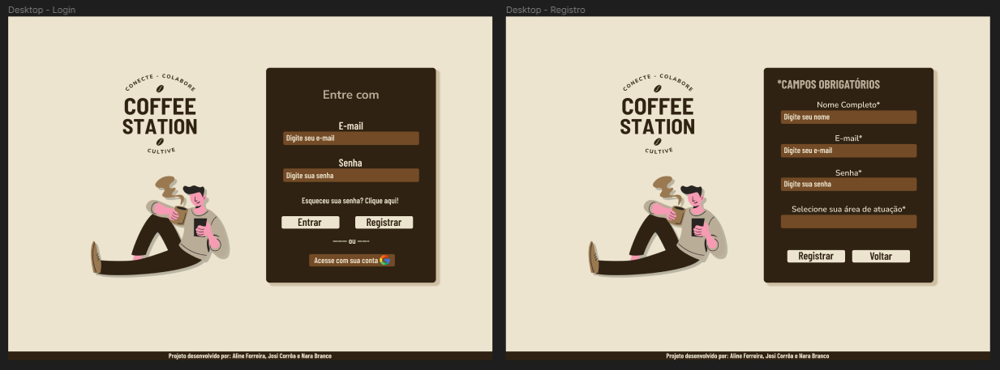
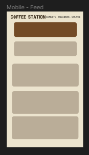
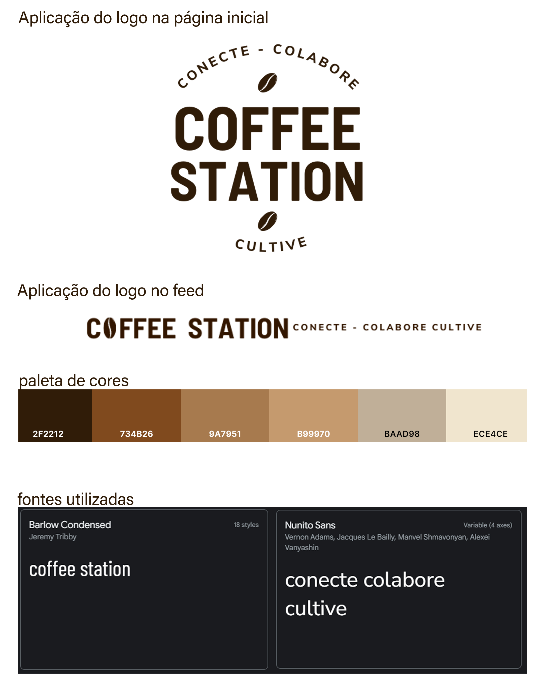
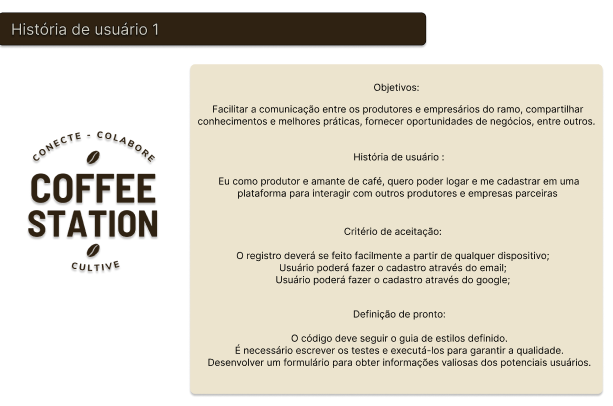
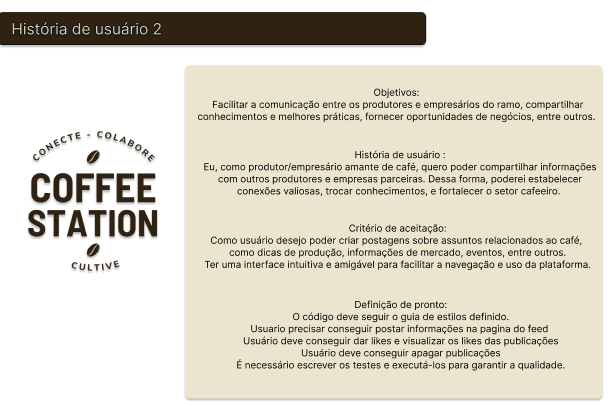

# Social Network - Coffee Station

## Índice 📌

* [1. Desenvolvedoras](#1-desenvolvedoras)
* [2. Resumo do projeto](#2-resumo-do-projeto)
* [3. Prefácio](#3-prefácio)
* [4. Protótipos](#4-protótipos)
* [5. Documentação de cores e fontes](#5-documentação-de-cores-e-fontes)
* [6. Histórias de Usuários](#6-histórias-de-usuários)
* [8. Guias, dicas e leituras
  complementares](#8-guias-dicas-e-leituras-complementares)

***

## 1. Desenvolvedoras 💻

Projeto desenvolvido por:

* Aline Ferreira [LinkedIn](link-linkedin) | [GitHub](link-github)
* Josielen Rubin [LinkedIn](link-linkedin) | [GitHub](link-github)
* Nara Alice Brando [LinkedIn](link-linkedin) | [GitHub](link-github)

## 2. Resumo do projeto 📚

Terceiro projeto proposto no bootcamp da Laboratória (turma SAP010). O objetivo era criar uma rede social na qual os usuários pudessem se registrar, logar, criar, dar _like_ e _deslike_ em publicações, além de poder excluir e editar suas próprias publicações. O projeto foi contruído em SPA e foi pensado utilizando o método _mobile first_. 

## 3. Prefácio ✏️

A Coffee Station foi pensada para profissionais da indústria do café, desde o agricultor até o empresário da cafeteria. Criada para criar essa conexão entre os profissionais para que possam compartilhar experiências e valores e para que possam criar laços e fortalecer ainda mais essa área que é imensa no Brasil.

## 4. Protótipos 📐

**Login**

Baixa fidelidade:

Alta fidelidade:

**Feed**
* Alta fidelidade:

![alta-fidelidade-feed][./src/images/prototipo-alta-fidelidade.png]

## 5. Documentação de cores e fontes 🖌

As cores e fontes do projeto foram pensadas e combinadas para passar uma sensação de formalidade informal, como a rede social é pensada para o ramo empresarial, nós escolhemos uma paleta de cores mais neutra e ao mesmo tempo que remetesse ao café e, a escolha das fontes _sans-serif_ trazem esse ar de informalidade mas mantem a seriedade por não ser tão desenhada. Abaixo a documentação:

## 6. Histórias de usuário 🖱

Seguimos duas histórias de usuários ao longo do projeto. Separamos elas por sprints e fomos dividindo as responsabilidades. Na primeira história, pensamos em como o usuário poderia se logar/se registrar na rede social. Resolvemos os problemas de autenticação pelo Firebase e conseguimos manter o usuário logado na página. Na história seguinte, resolvemos todas as questões do feed, tais como publicação, dar like em publicação, editar e deletar publicação e deslogar da rede social.

## 7. Tecnologias Utilizadas

## 8. Objetivos de aprendizagem

Reflita e depois enumere os objetivos que quer alcançar e aplique no seu projeto. Pense nisso para decidir sua estratégia de trabalho.

### HTML

✅ **Uso de HTML semântico**

### CSS

✅ **Uso de seletores de CSS**

✅ **Modelo de caixa (box model): borda, margem, preenchimento**

✅ **Uso de flexbox em CSS**

✅ **Uso de CSS Grid Layout**

### Web APIs

✅ **Uso de seletores de DOM**

✅ **Manipulação de eventos de DOM (listeners, propagação, delegação)**

✅ **Manipulação dinâmica de DOM**

✅ **Routing (History API, evento hashchange, window.location)**

### JavaScript

✅ **Arrays (arranjos)**

✅ **Objetos (key, value)**

✅ **Diferenciar entre tipos de dados primitivos e não primitivos**

✅ **Variáveis (declaração, atribuição, escopo)**

✅ **Uso de condicionais (if-else, switch, operador ternário, lógica booleana)**

✅ **Uso de laços (while, for, for..of)**

✅ **Funções (params, args, return)**

✅ **Testes unitários (unit tests)**

✅ **Testes assíncronos**

✅ **Uso de mocks e espiões**

✅ **Módulos de ECMAScript (ES modules)**

✅ **Uso de linter (ESLINT)**

✅ **Uso de identificadores descritivos (Nomenclatura e Semântica)**

✅ **Diferença entre expressões (expressions) e declarações (statements)**

✅ **Callbacks**

✅ **Promessas**

### Controle de Versões (Git e GitHub)

✅ **Git: Instalação e configuração**

✅ **Git: Controle de versão com git (init, clone, add, commit, status, push, pull, remote)**

✅ **Git: Integração de mudanças entre ramos (branch, checkout, fetch, merge, reset, rebase, tag)**

✅ **GitHub: Criação de contas e repositórios, configuração de chave SSH**

✅ **GitHub: Implantação com GitHub Pages**

✅ **GitHub: Colaboração pelo Github (branches | forks | pull requests | code review | tags)**

✅ **GitHub: Organização pelo Github (projects | issues | labels | milestones | releases)**

### Centrado no usuário

✅ **Desenhar e desenvolver um produto ou serviço colocando as usuárias no centro**

### Design de produto

✅ **Criar protótipos para obter feedback e iterar**

✅ **Aplicar os princípios de desenho visual (contraste, alinhamento, hierarquia)**

### Pesquisa

✅ **Planejar e executar testes de usabilidade**

### Firebase

✅ **Firebase Auth**

✅ **Firestore**